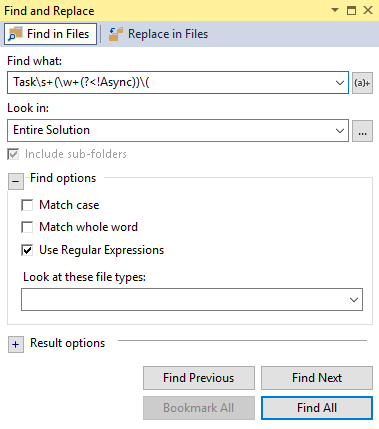

I tend to always forget to write the Async suffix in my asynchronous method names. Therefore, in order the find the bad method names, I use the following regular expression in Visual Studio to fix them quickly :

```
Task\s+(\w+(?<!Async))\(
``` 


